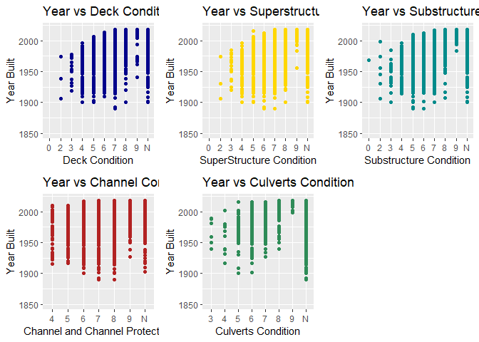

bridges\_homework
================
Yifan Zhang
2021/2/4

## Prerequisite

``` r
#install.packages("tidyverse")
#install.packages("backports")
library(tidyverse)
```

    ## -- Attaching packages --------------------------------------- tidyverse 1.3.0 --

    ## v ggplot2 3.3.3     v purrr   0.3.4
    ## v tibble  3.0.4     v dplyr   1.0.3
    ## v tidyr   1.1.2     v stringr 1.4.0
    ## v readr   1.4.0     v forcats 0.5.1

    ## -- Conflicts ------------------------------------------ tidyverse_conflicts() --
    ## x dplyr::filter() masks stats::filter()
    ## x dplyr::lag()    masks stats::lag()

## Import data

``` r
AllBridgeData <- read.csv("bridge_data.txt")
```

## Pick some variables

Make a file with bridge ID, year, fips codes, condition ratings, and a
few other variables. According to the data description, we need to find
item 8 (structure Number), item 27 (year), item 1 (state code), item
3(county code), item 4 (place code), and item 58 - 62 (condition
ratings). I am also interested in item 2 (highway agency district), item
16 (latitude), and item 17 (longitude).

``` r
BridgeData <- select(AllBridgeData, STRUCTURE_NUMBER_008, YEAR_BUILT_027, DECK_COND_058, SUPERSTRUCTURE_COND_059, SUBSTRUCTURE_COND_060, CHANNEL_COND_061, CULVERT_COND_062, STATE_CODE_001, COUNTY_CODE_003, PLACE_CODE_004, HIGHWAY_DISTRICT_002, LAT_016, LONG_017)
head(BridgeData)
```

    ##   STRUCTURE_NUMBER_008 YEAR_BUILT_027 DECK_COND_058 SUPERSTRUCTURE_COND_059
    ## 1      00000000000S702           1999             8                       8
    ## 2      00000000000S703           2002             8                       8
    ## 3      0000000000M0022           1942             5                       5
    ## 4      000000883039900           1974             7                       7
    ## 5      000001014002450           1937             5                       6
    ## 6      000001331700710           1924             5                       5
    ##   SUBSTRUCTURE_COND_060 CHANNEL_COND_061 CULVERT_COND_062 STATE_CODE_001
    ## 1                     7                6                N             01
    ## 2                     7                7                N             01
    ## 3                     6                6                N             01
    ## 4                     7                7                N             01
    ## 5                     5                9                N             01
    ## 6                     5                8                N             01
    ##   COUNTY_CODE_003 PLACE_CODE_004 HIGHWAY_DISTRICT_002  LAT_016 LONG_017
    ## 1              53              0                    9 31061094 87341348
    ## 2              53           3004                    9 31062020 87340890
    ## 3             113          19000                    0 32174330 84583799
    ## 4              59              0                    2 34270600 87581200
    ## 5              79              0                    2 34481800 87225400
    ## 6              33              0                    2 34480000 87373000

``` r
write.csv(BridgeData, "bridge_data_new", row.names = FALSE)
#show the file I made
NewData <- read.csv("bridge_data_new")
head(NewData)
```

    ##   STRUCTURE_NUMBER_008 YEAR_BUILT_027 DECK_COND_058 SUPERSTRUCTURE_COND_059
    ## 1      00000000000S702           1999             8                       8
    ## 2      00000000000S703           2002             8                       8
    ## 3      0000000000M0022           1942             5                       5
    ## 4      000000883039900           1974             7                       7
    ## 5      000001014002450           1937             5                       6
    ## 6      000001331700710           1924             5                       5
    ##   SUBSTRUCTURE_COND_060 CHANNEL_COND_061 CULVERT_COND_062 STATE_CODE_001
    ## 1                     7                6                N             01
    ## 2                     7                7                N             01
    ## 3                     6                6                N             01
    ## 4                     7                7                N             01
    ## 5                     5                9                N             01
    ## 6                     5                8                N             01
    ##   COUNTY_CODE_003 PLACE_CODE_004 HIGHWAY_DISTRICT_002  LAT_016 LONG_017
    ## 1              53              0                    9 31061094 87341348
    ## 2              53           3004                    9 31062020 87340890
    ## 3             113          19000                    0 32174330 84583799
    ## 4              59              0                    2 34270600 87581200
    ## 5              79              0                    2 34481800 87225400
    ## 6              33              0                    2 34480000 87373000

## Make a plot

In the warm-up section, we are required to make a plot. I decide to make
a plot with latitude and longitude.

``` r
plot(BridgeData$LAT_016, BridgeData$LONG_017, xlab = "latitude", ylab = "longitude", main = "Latitude&Longitude Map")
```

    ## Warning in xy.coords(x, y, xlabel, ylabel, log): NAs introduced by coercion

<!-- -->

This is a relatively easy visualization. We expect to see where most of
these bridges locate.

## Project Idea

## Subset of “interesting” bridges

I intend to make a subset of all Wisconsin bridges. According to the
data description, the FIPS code for Wisconsin State (Item 1) is 55.

``` r
WisconsinBridges <- BridgeData[which(BridgeData$STATE_CODE_001 == 55), ]
head(WisconsinBridges)
```

    ##        STRUCTURE_NUMBER_008 YEAR_BUILT_027 DECK_COND_058
    ## 199422      B05011200000000           1970             N
    ## 199423      B05011300000000           1970             N
    ## 199424      B05011800000000           1969             N
    ## 199425      B05011900000000           1974             7
    ## 199426      B05012000000000           1975             7
    ## 199427      B05012100000000           1975             8
    ##        SUPERSTRUCTURE_COND_059 SUBSTRUCTURE_COND_060 CHANNEL_COND_061
    ## 199422                       N                     N                8
    ## 199423                       N                     N                6
    ## 199424                       N                     N                7
    ## 199425                       8                     7                N
    ## 199426                       8                     7                N
    ## 199427                       8                     7                N
    ##        CULVERT_COND_062 STATE_CODE_001 COUNTY_CODE_003 PLACE_CODE_004
    ## 199422                7             55               9          54300
    ## 199423                6             55               9          56575
    ## 199424                4             55               9          35325
    ## 199425                N             55               9           3425
    ## 199426                N             55               9           3425
    ## 199427                N             55               9           3425
    ##        HIGHWAY_DISTRICT_002  LAT_016 LONG_017
    ## 199422                    3 44175855 87572999
    ## 199423                    3 44225062 87485192
    ## 199424                    3 44161205 88090839
    ## 199425                    3 44272255 88051238
    ## 199426                    3 44271642 88051610
    ## 199427                    3 44284200 88033600

## Analyze and visualization

Track how those bridges have changed over time. Make an interactive
visualization that helps to tell a story. I intend to build x-axis with
condition ratings (58-62) and y-axis with build year (item 27).

``` r
library(ggplot2)
#install.packages("ggpubr")
library(ggpubr)

a <- ggplot(WisconsinBridges, aes(DECK_COND_058, YEAR_BUILT_027)) + 
  labs(title = "Year vs Deck Condition", x = "Deck Condition", y = "Year Built") +
  ylim(1850, 2020) +
  geom_point(colour = "darkblue")

b <- ggplot(WisconsinBridges, aes(SUPERSTRUCTURE_COND_059, YEAR_BUILT_027)) + 
  labs(title = "Year vs Superstructure Condition", x = "SuperStructure Condition", y = "Year Built") +
  ylim(1850, 2020) +
  geom_point(colour = "gold")

c <- ggplot(WisconsinBridges, aes(SUBSTRUCTURE_COND_060, YEAR_BUILT_027)) + 
  labs(title = "Year vs Substructure Condition", x = "Substructure Condition", y = "Year Built") +
  ylim(1850, 2020) +
  geom_point(colour = "darkcyan")

d <- ggplot(WisconsinBridges, aes(CHANNEL_COND_061, YEAR_BUILT_027)) + 
  labs(title = "Year vs Channel Condition", x = "Channel and Channel Protection", y = "Year Built") +
  ylim(1850, 2020) +
  geom_point(colour = "firebrick")

e <- ggplot(WisconsinBridges, aes(CULVERT_COND_062, YEAR_BUILT_027)) + 
  labs(title = "Year vs Culverts Condition", x = "Culverts Condition", y = "Year Built") +
  ylim(1850, 2020) +
  geom_point(colour = "seagreen")

ggarrange(a, b, c, d, e, ncol = 3, nrow = 2)
```

    ## Warning: Removed 4 rows containing missing values (geom_point).
    
    ## Warning: Removed 4 rows containing missing values (geom_point).
    
    ## Warning: Removed 4 rows containing missing values (geom_point).
    
    ## Warning: Removed 4 rows containing missing values (geom_point).
    
    ## Warning: Removed 4 rows containing missing values (geom_point).

<!-- -->

## Conclusion

From the above visualization, we found that:

1.The ggplot of deck condition is similar to the ggplot of
superstructure condition. These two variables may be related to each
other.

2.Overall the channel condition is the best, because the minimum of
channel condition of bridges in WI is 4.
